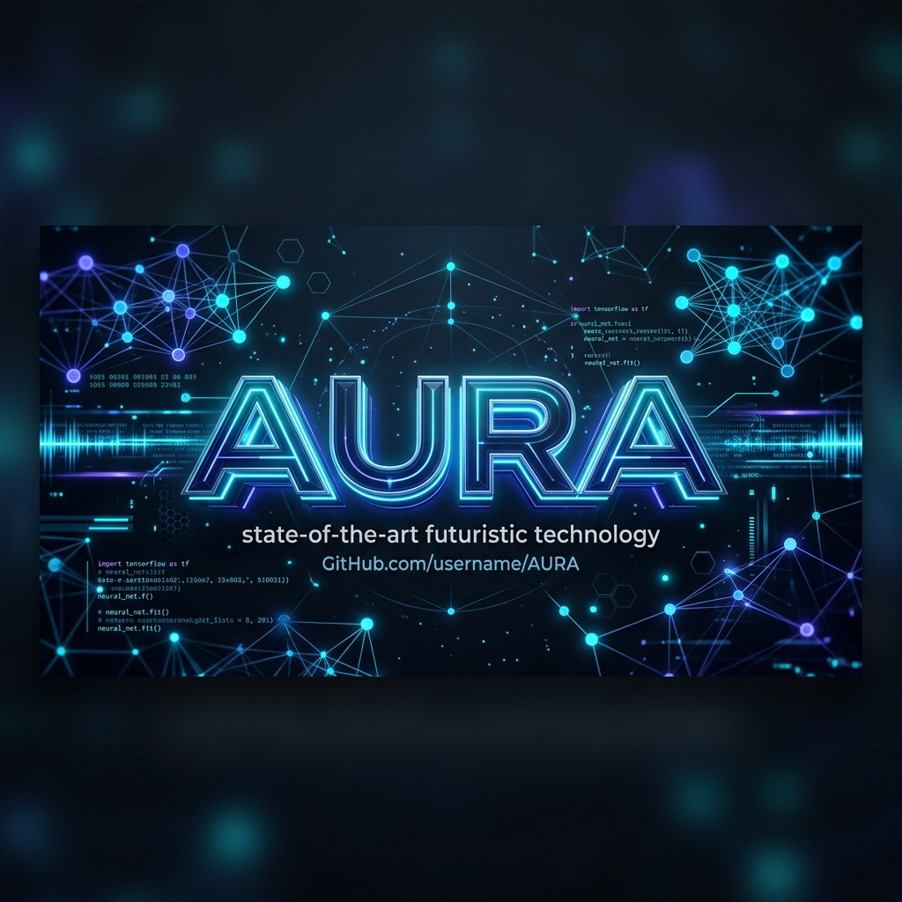
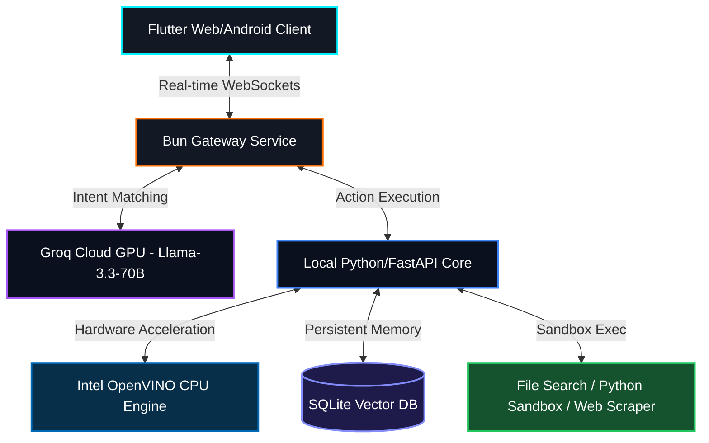

# AURA (Artificial Unified Reasoning Assistant)

<div align="center">
  
  <br />
  
  [](https://opensource.org/licenses/MIT)
  [](https://flutter.dev)
  [](https://fastapi.tiangolo.com)
  [](https://software.intel.com/content/www/us/en/develop/tools/openvino-toolkit.html)
  [](https://github.com/arvijayadhith7/Artificial-unified-reasoning-assistant--Aura-/releases)
  [](https://github.com/arvijayadhith7/Artificial-unified-reasoning-assistant--Aura-)
  [](https://github.com/arvijayadhith7/Artificial-unified-reasoning-assistant--Aura-/actions)
  
  <h3>The Next Generation of Autonomous, High-Speed Intelligence</h3>
  <p><b>Unified Reasoning. Agentic Power. Lightning Speed.</b></p>
</div>

---

## 🌟 Introduction

**AURA** is an enterprise-grade, high-performance hybrid AI assistant ecosystem designed to bridge the gap between lightning-fast cloud intelligence and private, localized tool-calling capabilities. Featuring a gorgeous glassmorphic Flutter client and a high-speed Python/Bun backend gateway, AURA delivers real-time workspace tracking, contextual screen scanning, and self-improving memory recall.

Unlike standard LLM interfaces, AURA is specifically engineered for custom hardware configurations, integrating **Intel OpenVINO** instruction sets to provide hardware-accelerated "Turbo Mode" inference directly on consumer CPUs (e.g., Intel Core i3) without requiring expensive Nvidia GPUs.

---

## 🎥 Demo in Action

> **Placeholder:** Insert a GIF or embedded video here showing the glassmorphism UI, reasoning engine in action, and screen overlay capabilities.
> 
> *Screenshot coming soon!*

---

## 🚀 Quick Start (Docker)

Want to run AURA immediately without installing dependencies? Use our single-command Docker Setup!

```bash
git clone https://github.com/arvijayadhith7/Artificial-unified-reasoning-assistant--Aura-.git
cd "Artificial-unified-reasoning-assistant--Aura-"
docker-compose up -d
```
That's it! Open `http://localhost:3000` in your browser.

---

## ⚡ Core Capabilities

| Feature | Details |
| :--- | :--- |
| **⚡ Instant Reasoning** | Powered by hybrid cloud-scale models (**Groq Llama-3.3-70B** / **OpenRouter Gemini 2.0 Flash**) delivering extreme inference throughput. |
| **🧠 Local Agentic Brain** | Orchestrates private local tool-calling workflows utilizing optimized **Qwen2.5-0.5B-Instruct** running directly in a secure local environment. |
| **💻 OpenVINO Intel "Turbo"** | Bypasses CUDA GPU requirements by using Intel CPU AI acceleration instructions to execute local models at high speeds. |
| **🧬 Real-time Neural Overlay** | A transparent Flutter layout tracker that captures active workflow contexts and serves recommendations over secure WebSockets. |
| **🌐 Ultra-High-Speed Gateway** | Engineered on the **Bun Runtime** for sub-millisecond real-time message routing and robust Content Security Policies (CSP). |
| **🛠️ Autonomous Tool Registry** | Localized tool suite including recursive **File Search**, a secure **Python Sandbox Interpreter**, and BeautifulSoup **Web Scraper**. |
| **💾 SQLite-backed Vector Memory** | Stores and analyzes historical conversation context, user preferences, and intermediate agentic thoughts. |

---

## ⚔️ Feature Comparison

How AURA stacks up against the competition:

| Feature | AURA | ChatGPT Plus | Claude Pro |
| :--- | :---: | :---: | :---: |
| **Glassmorphic Flutter UI** | ✅ | ❌ | ❌ |
| **Hybrid Cloud/Local Reasoning** | ✅ | ❌ | ❌ |
| **Intel CPU OpenVINO Accel.** | ✅ | ❌ | ❌ |
| **Transparent Screen Overlay** | ✅ | ❌ | ❌ |
| **Open Source** | ✅ | ❌ | ❌ |

---

## 📐 Architecture Overview

AURA operates on a **Unified Gateway Pattern** to coordinate real-time UI interactions, high-speed routing, and hybrid cloud-local execution cores:



---

## 🚀 Installation & Setup

### Prerequisites
- **Flutter SDK** (v3.22.0+ for CanvasKit and WebAssembly support)
- **Bun Runtime** (for gateway execution) or **Node.js v18+**
- **Python 3.10+**
- **Intel OpenVINO Toolkit** (Automatically configured during local setup)

### 1. Repository Setup
```bash
# Clone the repository
git clone https://github.com/arvijayadhith7/Artificial-unified-reasoning-assistant--Aura-.git
cd "Artificial-unified-reasoning-assistant--Aura-"
```

### 2. High-Performance Gateway (Bun)
```bash
cd backend
# Install dependencies
bun install # Or npm install
# Configure environment keys (create a .env file)
# PORT=3000
# GROQ_API_KEY=your_groq_key
# OPENROUTER_API_KEY=your_openrouter_key

# Run the high-performance gateway
bun server.js # Or node server.js
```

### 3. Local Cognitive Engine (Python / FastAPI)
```bash
cd ../python_backend
# Set up a virtual environment and install optimized dependencies
python -m venv venv
source venv/bin/activate # Or venv\Scripts\activate on Windows
pip install -r requirements.txt

# Run local tool-calling service
python main.py
```

### 4. Desktop/Mobile Client (Flutter)
```bash
# From the project root directory
flutter pub get

# Launch Flutter Web Client
flutter run -d chrome --web-renderer canvaskit

# Generate standalone Android APK (remote control your desktop brain!)
flutter build apk --release
```

---

## 🎮 Windows One-Click Launcher

For instant, multi-service local booting, use the built-in batch script in the root directory:

```powershell
# Run the local orchestrator (starts local LLM, web hosting, and opens AURA)
.\Aura-Launcher.bat
```

---

## 🔮 Incorporating Hermes Agent into AURA

Want to take AURA's performance to the next level? By integrating **Hermes Agent** (Nous Research's self-improving autonomous framework) as our primary local reasoning core, we can unlock:

1. **Closed-Loop Skill Generation:** AURA can dynamically write, test, and save its own Python tools (e.g., custom network scripts) during interaction, loading them as native workspace skills.
2. **Multi-Agent Swarms:** Delegate complex tasks (like full-stack codebase refactoring) to dedicated background subagents while maintaining a responsive UI.
3. **Advanced Memory Persistence:** Upgrade the SQLite Vector schema to utilize Hermes' three-tier fact accumulation architecture (`SOUL.md`, `MEMORY.md`, `USER.md`).

> [!TIP]
> To run a local Hermes Agent container sync with the AURA desktop layout, consult the **Integration Guide** inside `docs/HERMES_INTEGRATION.md`.

---

<div align="center">
  <p>Built with ❤️ by the AURA Engineering Team</p>
  <p>🌌 <i>Providing state-of-the-art hybrid reasoning for everyone.</i></p>
</div>
