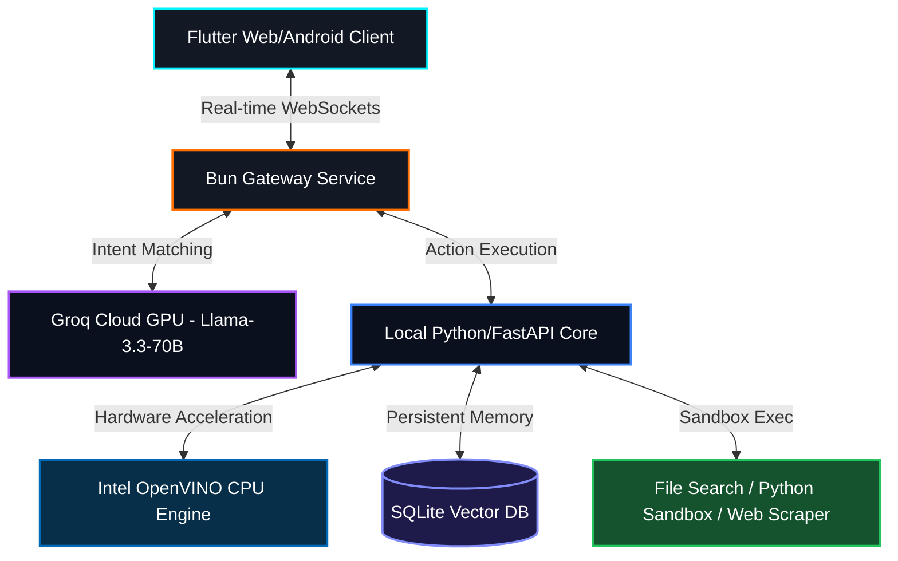

<div align="center">
  
</div>

# AURA: Artificial Unified Reasoning Assistant 🌌

<p align="center">
  <a href="https://opensource.org/licenses/MIT"></a>
  <a href="https://flutter.dev"></a>
  <a href="https://fastapi.tiangolo.com"></a>
  <a href="https://software.intel.com/content/www/us/en/develop/tools/openvino-toolkit.html"></a>
  <a href="https://github.com/arvijayadhith7/Artificial-unified-reasoning-assistant--Aura-/releases"></a>
  <a href="#"></a>
</p>

AURA is an enterprise-grade, high-performance hybrid AI assistant ecosystem designed to bridge the gap between lightning-fast cloud intelligence and private, localized tool-calling capabilities. Featuring a gorgeous glassmorphic Flutter client and a high-speed Python/Bun backend gateway, AURA delivers real-time workspace tracking, contextual screen scanning, and self-improving memory recall.

Unlike standard LLM interfaces, AURA is specifically engineered for custom hardware configurations, integrating **Intel OpenVINO** instruction sets to provide hardware-accelerated "Turbo Mode" inference directly on consumer CPUs without requiring expensive GPUs.

| Core Feature | Description |
| :--- | :--- |
| **⚡ Instant Reasoning** | Powered by hybrid cloud-scale models (**Groq Llama-3.3-70B** / **Gemini 2.0**) delivering extreme inference throughput. |
| **🧠 Local Agentic Brain** | Orchestrates private local tool-calling workflows utilizing optimized **Qwen2.5** running securely in a local sandbox. |
| **💻 OpenVINO "Turbo"** | Bypasses CUDA GPU requirements by using Intel CPU AI acceleration instructions to execute local models at high speeds. |
| **🧬 Neural Overlay** | A transparent Flutter layout tracker that captures active workflow contexts and serves recommendations over secure WebSockets. |
| **🌐 Ultra-Fast Gateway** | Engineered on the **Bun Runtime** for sub-millisecond real-time message routing and robust Content Security Policies (CSP). |
| **🛠️ Autonomous Tools** | Localized tool suite including recursive **File Search**, a secure **Python Sandbox Interpreter**, and a **Web Scraper**. |
| **💾 Persistent Memory** | SQLite-backed Vector DB stores and analyzes historical conversation context, user preferences, and intermediate agentic thoughts. |

---

## 🚀 Quick Install

### Option 1: Docker Compose (Recommended)
Want to run AURA immediately without installing dependencies? Use our single-command Docker Setup!

```bash
# Clone the repository
git clone https://github.com/arvijayadhith7/Artificial-unified-reasoning-assistant--Aura-.git
cd "Artificial-unified-reasoning-assistant--Aura-"

# Start the unified ecosystem
docker-compose up -d
```
That's it! Open `http://localhost:3000` in your browser.

### Option 2: Windows One-Click Launcher
For instant, multi-service local booting, use the built-in batch script in the root directory:
```powershell
.\Aura-Launcher.bat
```

---

## 🛠️ Manual Setup & Getting Started

If you prefer to run the ecosystem components natively for active development:

**1. High-Performance Gateway (Bun)**
```bash
cd backend
bun install
bun server.js
```

**2. Local Cognitive Engine (Python / FastAPI)**
```bash
cd python_backend
python -m venv venv
source venv/bin/activate  # On Windows: venv\Scripts\activate
pip install -r requirements.txt
python main.py
```

**3. Desktop/Mobile Client (Flutter)**
```bash
# From the project root directory
flutter pub get
flutter run -d chrome --web-renderer canvaskit
```

> **Note:** Generate a standalone Android APK to remote control your desktop brain:
> `flutter build apk --release`

---

## 📚 Documentation

| Resource | Description |
| :--- | :--- |
| [**Architecture Diagram**](#-architecture-overview) | Visual representation of the Unified Gateway Pattern. |
| [**Roadmap**](ROADMAP.md) | The future vision, planned features, and upcoming releases for AURA. |
| [**Contributing Guide**](CONTRIBUTING.md) | Learn how to set up your dev environment and contribute to the project. |
| [**Hermes Integration**](docs/HERMES_INTEGRATION.md) | Guide to hooking up the Nous Hermes autonomous swarm engine. |
| [**API Reference**](docs/API.md) | *(Coming Soon)* Complete reference for the FastAPI and Bun WebSocket endpoints. |

---

## 📐 Architecture Overview

AURA operates on a **Unified Gateway Pattern** to coordinate real-time UI interactions, high-speed routing, and hybrid cloud-local execution cores.



---

<div align="center">
  <p>Built with ❤️ by the AURA Engineering Team</p>
  <p>🌌 <i>Providing state-of-the-art hybrid reasoning for everyone.</i></p>
</div>
